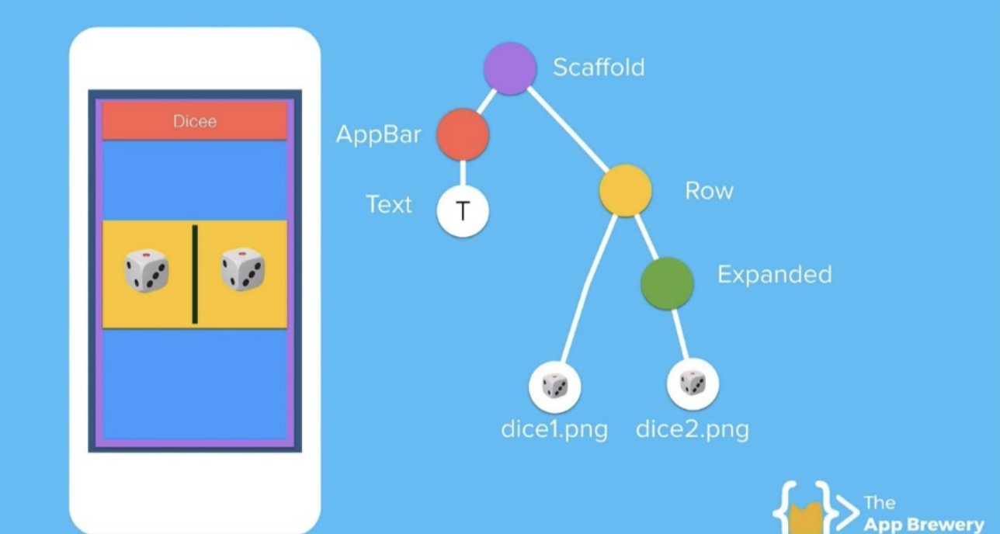

<h1>robocolLunaboticsApp</h1>

Interface for controlling the Robocol robot made on Lunabotics.

<h1>Documentación Interfaz – Lunabotics</h1>

    <ul>
        <li>
            <a href="#introduction">Introducción</a>
        </li>
        <li>
            <a href="#desarrollo">Herramientas de desarrollo utilizadas</a>
            <ul>
                <li><a href="#2.1.">Flutter</a></li>
                <ul>
                    <li><a href="#2.1.1.">¿Qué es Flutter?</a></li>
                    <li><a href="#2.1.2.">¿Por qué Flutter?</a></li>
                    <li><a href="#2.1.3.">¿Cómo funciona Flutter?</a></li>
                </ul>
                <li><a href="#2.2.">Dart</a></li>
                <li><a href="#2.3.">Android Studio</a></li>
            </ul>
        </li>
	<li>
            <a href="#descripcion">Descripción de la interfaz</a>
            <ul>
                <li><a href="#3.1.">Pantalla de inicio</a></li>
                <li><a href="#3.2.">Controlador de avance</a></li>
                <li><a href="#3.3.">Accionador permanente de la rueda excavadora</a></li>
		<li><a href="#3.4.">Accionador manual de la rueda excavadora</a></li>
		<li><a href="#3.5.">Controlador de movimientos de los actuadores lineales</a></li>
		<li><a href="#3.6.">Controlador de giro</a></li>
            </ul>
	</li>
	<li>
            <a href="#enlaces">Enlaces de interés recomendados</a>
            <ul>
                <li><a href="#4.1.">Sitio oficial de Flutter</a></li>
                <li><a href="#4.2.">Documentación oficial de Flutter</a></li>
		<li><a href="#4.3.">Introducción a Flutter</a></li>
		<li><a href="#4.4.">Artículos detallados con explicaciones sobre Flutter</a></li>
                <li><a href="#4.5.">Sitio oficial de Dart</a></li>
		<li><a href="#4.6.">Documentación oficial de Dart</a></li>
		<li><a href="#4.7.">Sitio oficial de Android Studio</a></li>
		<li><a href="#4.8.">Documentación oficial de Android Studio</a></li>
            </ul>
	</li>
    </ul>

<h2 id="introduction">1. Introducción</h2>

En el marco del proyecto “Lunabotics”, dentro el subsistema de Ingeniería de Sistemas y Computación, desarrollamos una aplicación móvil para Android y iOS, que funciona como interfaz visual del robot. La función principal de ésta consiste en permitirle a un usuario controlar los movimientos y funciones principales del Rover desarrollado por los demás subsistemas, a través de un medio sencillo e intuitivo. 
	
En breve, se pretende exponer el proceso de creación de esta aplicación, sus componentes principales, herramientas de 		 desarrollo utilizadas, entre otros aspectos que la conforman.  

<h2 id="desarrollo">2. Herramientas de desarrollo utilizadas</h2>

El primer paso para el desarrollo de la aplicación era decidir qué herramientas se utilizarían para lograrlo. Para esto, se optó por trabajar principalmente en Flutter y Android Studio. 

<h3 id="2.1.">2.1. Flutter</h3>

<h4 id="2.1.1.">2.1.1. ¿Qué es Flutter?</h4>

Flutter es un kit de herramientas de interfaz de usuario, creado por Google, para desarrollar aplicaciones nativas para dispositivos móviles Android y iOS, web y de escritorio desde una única base de código. Esta es la característica más atractiva de Flutter, que desde un único código se autogenera una aplicación diferente para una gran cantidad de dispositivos y plataformas, los cuales usan sistemas operativos, frameworks y lenguajes diferentes.  

Anteriormente, si quisiéramos ejecutar una aplicación en varios dispositivos, tendríamos que desarrollar la misma aplicación específicamente para cada plataforma, por lo que Flutter es una herramienta que ahorra mucho tiempo en el desarrollo de nuestro proyecto. 

A continuación, enumeramos unas de las principales características de Flutter, al igual que las razones para construir nuestra interfaz con esta herramienta. 

<h4 id="2.1.2.">2.1.2. ¿Por qué Flutter?</h4>

* Con Flutter podemos crear nuestra aplicación para Android y iOS, al mismo tiempo, con una única base de código. 

* El proceso de creación de interfaces con Flutter es sencillo e intuitivo, gracias a su sistema de Widgets, donde cada widget es una declaración inmutable de parte de la interfaz de usuario.  

* Es de código abierto, y tiene una gran comunidad creciente de desarrolladores que lo utilizan y aportan a su crecimiento. Flutter cuenta con un sistema de paquetes, que básicamente son código funcional creado por cualquier desarrollador, y que ha compartido con el resto de la comunidad. De esta manera, si llegáramos a necesitar esta funcionalidad que este desarrollador ya ha creado, simplemente debemos importarla a nuestro proyecto y podremos utilizarla sin problema, lo que ahorra una gran cantidad de tiempo. 

* Otra gran característica de Flutter es su Hot Reload. Esta es una funcionalidad que permite compilar el código que hemos escrito de manera casi inmediata y ver los cambios realizados directamente en el dispositivo móvil o en un emulador. Esto es muy importante, ya que, en el desarrollo convencional de aplicaciones nativas, este proceso de compilación puede llegar a ser bastante demorado, al tener que exportar la aplicación, instalarla, y hacer una serie de pasos adicionales. “La funcionalidad hot reload de Flutter te ayuda a rápida y fácilmente experimentar, construir UIS, añadir funcionalidades y arreglar bugs. Hot reload trabaja inyectando ficheros de código fuente actualizados en la Máquina Virtual (VM) Dart en ejecución.” (https://flutter-es.io/docs/development/tools/hot-reload) 

Resumen técnico de Flutter: https://flutter-es.io/docs/resources/technical-overview 

<h4 id="2.1.3.">2.1.3. ¿Cómo funciona Flutter?</h4>

Flutter se basa en un sistema de Widgets. Todo dentro de una aplicación Flutter es un widget, desde un simple texto, botones o cualquier diseño. Estos widgets se organizan en un orden jerárquico para mostrarse en la pantalla. Es decir, un widget puede componerse de varios widgets, y éstos a la vez de más widgets. Es así cómo se estructuran las aplicaciones, en una composición de widgets, de la que obtenemos una organización jerárquica. 

En el siguiente ejemplo se puede ver este concepto. Esta es la representación visual de la composición de una app básica en Flutter. En este caso, está compuesta de un Widget Scaffold, que es un Widget de diseño (para situar elementos en la pantalla), que está compuesto de dos Widgets, un AppBar y un Row (Fila). El AppBar se compone de un Widget de Texto, y el Row está compuesto por Widgets Image. De esta manera podemos diseñar nuestra aplicación y agregarle más y más elementos. 

Existe una clasificación general para los Widgets en Flutter. Estos pueden ser Stateless Widgets (Widgets sin estado) o Stateful Widgets (Widgets con estado). De esta manera diferenciamos los widgets que tendrán una funcionalidad dentro de la aplicación (con estado) y los que generalmente sólo desplegarán información (sin estado). Por ejemplo, un Stateless widget podría ser un widget imagen o texto, y un Stateful Widget un botón o un slider. El estado del Widget nos permitirá asignarle su funcionalidad. 

<h3 id="2.2.">2.2. Dart</h3>

Dart es el lenguaje de programación con el que se desarrollan las aplicaciones en Flutter. Éste fue creado por Google, tiene una gran aceptación en la comunidad, por lo que su uso está creciendo rápidamente, y es muy similar a muchos otros lenguajes orientados a objetos. Debido a esto, su aprendizaje resulta bastante sencillo si ya se ha trabajado con lenguajes como Java o C, entre otros. 

<h3 id="2.3.">2.3. Android Studio</h3>

Android Studio es el entorno de desarrollo integrado (IDE) oficial para el desarrollo de apps para Android, es decir, es el programa en el cual podemos escribir código en Dart y crear nuestras aplicaciones Flutter.  

Para crear una aplicación con este framework, Google recomienda usar Android Studio o Visual Studio Code, un IDE desarrollado por Microsoft. Sin embargo, Android Studio posee características que hacen mucho más sencillo el desarrollo, como mayor facilidad para ejecutar un simulador de un dispositivo Android y probar nuestra aplicación, consejos de optimización del código, estadísticas de uso, entre otras. 

<h2 id="descripcion">3. Descripción de la interfaz</h2>

<h3 id="3.1.">3.1. Pantalla de inicio</h3>
<h3 id="3.2.">3.2. Controlador de avance</h3>
<h3 id="3.3.">3.3. Accionador permanente de la rueda excavadora</h3>
<h3 id="3.4.">3.4. Accionador manual de la rueda excavadora</h3>
<h3 id="3.5.">3.5. Controlador de movimientos de los actuadores lineales</h3>
<h3 id="3.6.">3.6. Controlador de giro</h3>

<h2 id="enlaces">4. Enlaces de interés recomendados</h2>

<a href="https://flutter.dev/?gclid=CjwKCAjwkPX0BRBKEiwA7THxiP6-pViqoK8EP5-xIhdTuWfwQN8uOIz6oYA4mgdGGbWbp1nfuEpdVxoCcPEQAvD_BwE&gclsrc=aw.ds" target="_blank" id="4.1.">
	4.1 Sitio oficial de Flutter
</a>
<a href="https://flutter.dev/docs" target="_blank" id="4.2.">
	4.2 Documentación oficial de Flutter
</a>
<a href="https://www.appbrewery.co/p/intro-to-flutter" target="_blank" id="4.3.">
	4.3 Introducción a Flutter
</a>
<a href="https://medium.com/flutter-community" target="_blank" id="4.4.">
	4.4 Artículos detallados con explicaciones sobre Flutter
</a>
<a href="https://dart.dev/" target="_blank" id="4.5.">
	4.5 Sitio oficial de Dart
</a>
<a href="https://dart.dev/guides" target="_blank" id="4.6.">
	4.6 Documentación oficial de Dart
</a>
<a href="https://developer.android.com/studio" target="_blank" id="4.7.">
	4.7 Sitio oficial de Android Studio
</a>
<a href="https://developer.android.com/docs" target="_blank" id="4.8.">
	4.8 Documentación oficial de Android Studio
</a>
